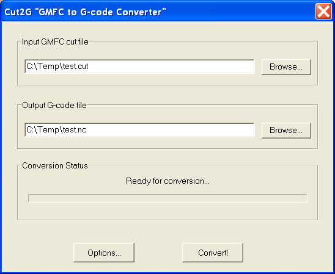
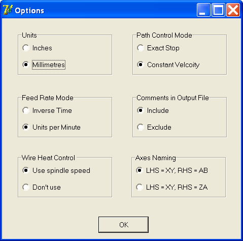

# cut2g
## GMFC Cut File to G-Code Conversion Software

This little program converts cut files generated by GMFC foam cutting software into g-code files for use with CNC controllers.

**Update Dec 2012:**  Somewhere in the past few years, Mach3 changed the character is recognised as comments in G-code files (from "%%**%%" to "%"), despite the documentation saying otherwise.  I've finally got around to updating the code accordingly.

## Can I have a copy ?

Sure you can.  It's free for personal use.

**As of Mar 2024:** this project has been open sourced.  Go for it.  MIT License.

Note for developers: Originally written using Delphi 7 way back in 2007.  You might have luck using a somewhat recent version of RAD Studio from Embarcadero to convert it to something more modern (or replace the UI entirely - the underlying conversion code should be pretty obvious from the pascal files).

## Installation

No installation is required, other than simply putting the executable into a convenient folder on your computer.  It will quite happily run on the desktop.

## Main Screen
Use the "browse" buttons to first select the input cut file (you create this in GMFC by using the "cut to file" option when panel cutting), and the output g-code file.  You can choose to either create a .tap file or .nc file - the only difference is the filename extension, the file contents are identical.

## Options Screen
In normal use, you don't really need to worry about changing any of these options.  Descriptions of the various settings:
  * **Units**: sets the g-code file to either use inches or millimetres.  Note that "cut2g" doesn't scale any of the data in the cut file.
  * **Path Control Mode**: sets the g-code file to use either Exact Stop or Control Velocity modes.  Google this if you don't know the difference.
  * **Feed Rate Mode**: again, Google will tell you the difference better than I could :)
  * **Comments in Output File**: The g-code file produced by "cut2g" will include comments to make it easier for you to understand what the various commands do.  However some g-code interpreters seem to have difficulties with the comment characters (giving "invalid character" type errors), so turn off comments here if you encounter this.
  * **Wire Heat Control**: The wire heat control data from GMFC is converted to PWM spindle speed data in the g-code file.  Turn it off with this option if you don't want or need this information.
  * **Axes Naming**: This allows to choose between two axes naming conventions.  Both assume the left hand axes on your cutter are X and Y, however the option lets you select whether the right-hand axes are A and B, or Z and A.

